# ProperTea Frontend

Web application for [ProperTea](https://github.com/jorgejarne/propertea-backend) — AI-powered property onboarding with live video assistance.

Built with [Loveable](https://lovable.dev).

## Architecture

```mermaid
flowchart TB
    subgraph CLIENT["🖥️ Client Layer"]
        User((👤 User))
        App[React App]
    end

    subgraph PAGES["📄 Pages"]
        Dashboard[Dashboard]
        SpaceLive[Space Live]
        PropertyDetail[Property Detail]
        Explore[Explore]
    end

    subgraph REALTIME["⚡ Live Session"]
        WS{{WebSocket}}
        
        subgraph STREAMS["Multimodal Streams"]
            LiveAgent((🎙️ Ms. T<br/>Live Agent))
            Video((📹 Video<br/>Stream))
            Audio((🔊 Audio<br/>Stream))
        end
    end

    subgraph BACKEND["🔧 Backend Services"]
        RealtimeServer{{Realtime<br/>Server}}
        Functions[/Supabase<br/>Functions/]
        
        subgraph TOWER["Tower.dev"]
            FloorEngine[[Floor Plan<br/>Generator]]
        end
    end

    subgraph AI["🧠 Intelligence Layer"]
        LiveModel((Realtime<br/>Model))
        TextModel((Text<br/>Model))
        VisionModel((Vision<br/>Model))
    end

    space1[ ]
    style space1 fill:none,stroke:none

    subgraph DATA["💾 Supabase"]
        DB[(PostgreSQL)]
        Storage[(Storage)]
        Auth[Auth]
    end

    %% Client navigation
    User --> App
    App --> Dashboard
    App --> SpaceLive
    App --> PropertyDetail
    App --> Explore

    %% Dashboard flows
    Dashboard --> Functions
    Dashboard --> DB
    PropertyDetail --> Functions
    PropertyDetail --> Storage

    %% Live session
    SpaceLive <--> WS
    WS --- LiveAgent
    WS --- Video
    WS --- Audio

    %% Backend connections
    WS <--> RealtimeServer
    RealtimeServer <--> LiveModel
    Functions --> TextModel
    Storage --> FloorEngine
    FloorEngine --> VisionModel

    %% Spacer
    AI ~~~ space1
    space1 ~~~ DATA

    %% Data persistence
    RealtimeServer --> DB
    Functions --> DB
    FloorEngine --> Storage
    LiveModel -.->|function calls| DB
    TextModel -.->|extraction| DB

    %% Auth
    App --> Auth

    %% Styling
    classDef userNode fill:#e1f5fe,stroke:#01579b,stroke-width:2px
    classDef aiNode fill:#f3e5f5,stroke:#7b1fa2,stroke-width:2px
    classDef dataNode fill:#e8f5e9,stroke:#2e7d32,stroke-width:2px
    classDef computeNode fill:#fff3e0,stroke:#ef6c00,stroke-width:2px
    classDef streamNode fill:#fce4ec,stroke:#c2185b,stroke-width:2px
    classDef pageNode fill:#e3f2fd,stroke:#1565c0,stroke-width:2px

    class User userNode
    class LiveModel,TextModel,VisionModel aiNode
    class DB,Storage,Auth dataNode
    class WS,RealtimeServer,Functions,FloorEngine computeNode
    class LiveAgent,Video,Audio streamNode
    class Dashboard,SpaceLive,PropertyDetail,Explore pageNode
```



## Features

- **Dashboard** — Manage properties and event spaces with grid/table views
- **Live Onboarding** — Video call with Ms. T, our AI property assistant
- **Document Upload** — Upload floor plans, images, PDFs for AI processing
- **Floor Plan Generation** — AI-generated 2D floor plans from uploaded documents
- **Property Explorer** — Browse and discover published properties
- **Real-time Transcription** — Live speech-to-text during video sessions

## Tech Stack

- React 18 + TypeScript
- Vite
- Tailwind CSS + shadcn/ui
- Supabase (Auth, Database, Storage, Edge Functions)
- React Query
- Framer Motion
- WebSocket (for live sessions)

## Getting Started

```bash
npm install
npm run dev
```

## Environment Variables

```
VITE_SUPABASE_URL=<supabase-url>
VITE_SUPABASE_ANON_KEY=<supabase-anon-key>
VITE_REALTIME_BACKEND_URL=<realtime-server-url>
VITE_OPENAI_API_KEY=<openai-api-key>
```

## Project Structure

```
src/
├── components/     # Reusable UI components
├── contexts/       # React contexts (Auth, FileUpload)
├── hooks/          # Custom hooks
├── integrations/   # Supabase client & types
├── pages/          # Route pages
└── lib/            # Utilities
```

## Related

- **Backend**: [github.com/jorgejarne/proper-tea-berlin-hackaton](https://github.com/jorgejarne/propertea-backend)
